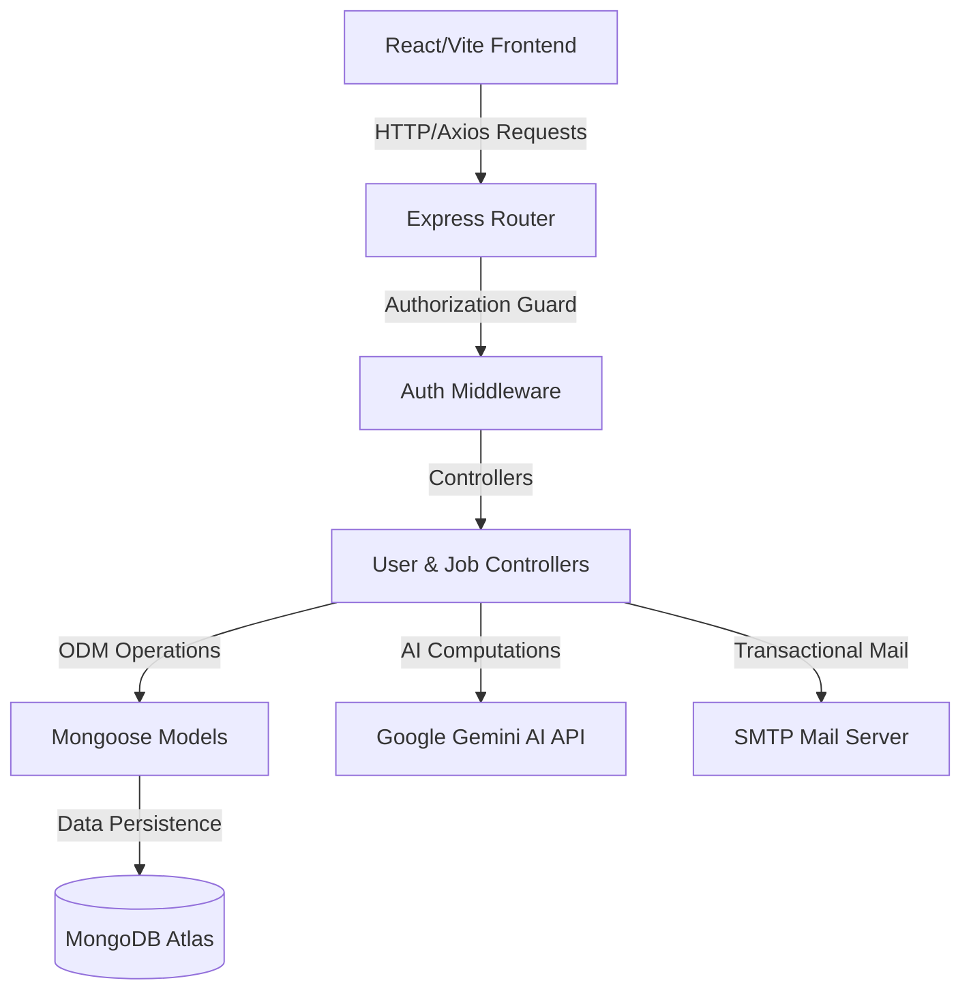

# Job Catch - AI-Powered Job Portal

Job Catch is a full-stack, AI-integrated job board application built using the MERN stack (MongoDB, Express, React/Vite, Node.js). It includes features like semantic AI resume search, automated matching score generation, real-time AI mock interviews, and secure OTP logins with Nodemailer.

---

## 🛠️ Architecture Overview

The project is split into two independent services:



* **Frontend (`/client`)**: React application styled with Tailwind CSS, using Vite as a build tool and Axios for server communications.
* **Backend (`/server`)**: Node.js and Express RESTful API, connecting to MongoDB Atlas via Mongoose and utilizing Google Gemini for smart analysis.

---

## 🚀 Setup & Execution Guide

### Prerequites
* Node.js (v18+ recommended)
* MongoDB database URI (Atlas or Local)
* Google Gemini API Key
* Gmail App Password (for SMTP)

### 1. Backend Setup
Navigate into the server folder, configure your environment, and start the backend:
```bash
cd server
npm install
```

Create a `.env` file in the `server` directory:
```env
PORT = 8000
JWT_SECERET = "your_jwt_secret_phrase"
MONGO_URL = "mongodb+srv://..."
GEMINI_API_KEY = "your_gemini_api_key"
SMTP_USER = "your-email@gmail.com"
SMTP_PASS = "your-16-character-app-password"
SENDER_EMAIL = "your-email@gmail.com"
SMTP_SERVICE = "gmail"
SMTP_HOST = "smtp.gmail.com"
SMTP_PORT = "587"
SMTP_SECURE = "false"
```

Start the backend:
```bash
npm start
```

### 2. Frontend Setup
Navigate into the client folder, install dependencies, and run the hot-reload dev server:
```bash
cd ../client
npm install
npm run dev
```

The frontend will run at `http://localhost:5173/`, and automatically proxies/connects to the backend at `http://localhost:8000/`.

---

## 🧠 Backend Developer's Learning Guide
This project is an excellent sandbox to learn modern backend engineering patterns. Here are the core areas to study and how they are implemented:

### 🔑 1. Passwordless OTP Auth & JWT Session Management
* **Where to find**: [server/controller/userAuth.js](file:///d:/Downloads/backend%20(nodejs)/job-portal/server/controller/userAuth.js#L698)
* **What you can learn**:
  * **OTP Expiration**: Notice how OTP verification sets `loginOtpExpires = Date.now() + 10 * 60 * 1000`. In databases, managing token lifespans defensively is essential.
  * **JWT Generation**: In [server/model/userModel.js](file:///d:/Downloads/backend%20(nodejs)/job-portal/server/model/userModel.js#L137), look at `userSchema.methods.createJWT`. Encapsulating JWT signing as a Mongoose method keeps controllers clean and DRY.

### 🛡️ 2. Role-Based Middleware & Request Context
* **Where to find**: [server/middleware/authHandler.js](file:///d:/Downloads/backend%20(nodejs)/job-portal/server/middleware/authHandler.js)
* **What you can learn**:
  * **Context Enrichment**: The middleware parses the header `Authorization: Bearer <token>`, decodes it, and attaches the payload directly onto the request object: `req.user = payload`.
  * **Role Guards**: Controllers check `req.user.role === 'seeker'` to prevent candidates from posting jobs or recruiter actions.

### 💾 3. Defensive Schema Design & Mongoose Population
* **Where to find**: [server/model/userModel.js](file:///d:/Downloads/backend%20(nodejs)/job-portal/server/model/userModel.js) and [server/model/jobModel.js](file:///d:/Downloads/backend%20(nodejs)/job-portal/server/model/jobModel.js)
* **What you can learn**:
  * **Pre-Save Hooks**: Look at `userSchema.pre("save", ...)` in `userModel.js`. It automatically hashes passwords using `bcrypt` and generates unique referral codes whenever a new seeker profile is saved.
  * **Stripping Fields**: When using Mongoose, nested objects must define their schema fields explicitly. (e.g. `recruiterVerification`). If you pass properties not listed in the schema, Mongoose strips them before saving to prevent schema pollution.
  * **Population vs. ID Referencing**: Notice how `applicationModel.js` stores a simple reference `jobId: { ref: 'Job' }`. When queried, the controller calls `.populate("jobId")` to dynamically merge the full job information. In the frontend, this turns the simple ID string into a populated JavaScript object.

### 🤖 4. AI Prompt Engineering & Fallback Mechanics
* **Where to find**: [server/controller/applicationController.js](file:///d:/Downloads/backend%20(nodejs)/job-portal/server/controller/applicationController.js#L36)
* **What you can learn**:
  * **Structured JSON Extraction**: Look at how the Gemini prompt enforces the response structure: *"Your response must be JSON formatted exactly as..."*.
  * **Resilient Fallbacks**: AI APIs can fail, timeout, or rate-limit. Notice how every Gemini call is wrapped in a `try/catch` block with hardcoded local fallback calculations (e.g. basic keyword matching). This guarantees that even if Gemini is down, the core website application never crashes.

---

## 📈 Leveling Up: Practical Exercises
To advance your backend skills, try implementing these enhancements in the server:

1. **Add Rate Limiting**: Implement a library like `express-rate-limit` on the `/send-otp` route to prevent attackers from spamming your SMTP server and draining resources.
2. **Setup Winston Logger**: Replace `console.log` statements with a production-grade logging package like `winston`, logging errors to a file and info outputs to the console.
3. **Mongoose Transactions**: When a candidate applies for a job, wrap the application creation and referral point increases in a Mongoose session transaction to ensure all operations succeed together or roll back gracefully on failure.
