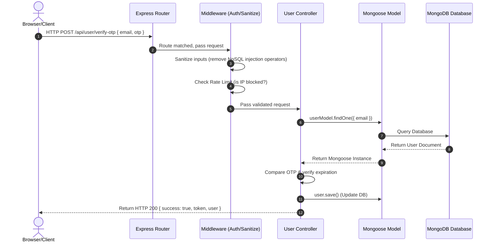

# 🎓 Job Catch - Backend Engineering Learning Guide
> **Tutor**: Antigravity (Google DeepMind Coding Assistant)
> **Goal**: Study the architecture, request life cycles, design principles, and production fixes implemented in this project to become a production-ready backend developer.

---

## 📁 1. Project Folder Structure

This workspace is designed as a **decoupled monorepo** containing two main directories:

```text
job-portal/
├── client/                 # Frontend React/Vite Application
│   ├── src/
│   │   ├── api/            # API base configurations (Axios endpoints)
│   │   ├── context/        # React Context (AuthContext manages global user session)
│   │   ├── Pages/          # Views (Dashboard, Login, Register, AllJobs)
│   │   └── main.jsx        # App mounting point
│   ├── .env.local          # Local client env overrides (e.g. VITE_API_BASE_URL)
│   └── vite.config.js      # Vite compilation configurations
│
├── server/                 # Backend Node.js/Express REST API
│   ├── config/             # DB connection helpers
│   ├── controller/         # Request handlers (processes req, talks to model, sends res)
│   ├── middleware/         # Intermediate filters (Auth verify, Rate limiters, Sanitizers)
│   ├── model/              # MongoDB Mongoose schemas (Defines structure of collections)
│   ├── routes/             # Express Route declarations (Maps URLs to Controllers)
│   ├── test/               # Dev/Test scripts (matchTest, testOtpEmail)
│   ├── utils/              # Third-party utilities (Nodemailer, Gemini, Seeders)
│   ├── .env                # Local secret variables
│   └── server.js           # Server starter file (Bootstrap file)
```

---

## 🔄 2. The MERN Data Flow (Request Life Cycle)

When a candidate logs in, searches for a job, or reviews applicants, the data flows step-by-step through the application:



1. **Trigger**: The React client triggers an Axios HTTP request.
2. **Routing**: The request hits `server.js` and is matched to a route prefix (e.g., `/api/user`).
3. **Middleware Guards**: The request is sanitized (stripping NoSQL operators) and rate-limited. If it is a protected route, the `userAuth` middleware validates the JWT bearer token.
4. **Processing**: The controller receives the request, runs business logic, and queries MongoDB via Mongoose.
5. **Persistence**: MongoDB stores/updates the data and returns the documents.
6. **Response**: The controller constructs a structured JSON response (e.g. `{ success: true, data }`) and sends it back to the client.

---

## 💾 3. Database Design & Mongoose Schemas

We have three core database models:
1. **`User`**: Manages credentials, roles (`seeker`, `employer`, `admin`), verified skills, and validation tokens.
2. **`Job`**: Represents job listings, salaries, locations, and scam analysis.
3. **`Application`**: Represents a connection mapping between a `User` (candidate) and a `Job` (position).

### Core Concepts to Learn:
* **Compound Indexes**: In `applicationModel.js`, we prevent a user from applying to the same job twice by setting a compound index:
  ```javascript
  applicationSchema.index({ jobId: 1, candidateId: 1 }, { unique: true });
  ```
  This is a database-level constraint that ensures data integrity even if parallel API requests are sent.
* **Mongoose Population**: Mongoose documents store relationship IDs (`ObjectId`). During queries, we use `.populate("createdBy")` or `.populate("candidateId")` which dynamically fetches the related document fields, making nested details available to the frontend.

---

## 🎮 4. How to Write a Clean Controller

A controller's job is **Request Validation ➡️ Business Logic ➡️ Database Operation ➡️ Response Dispatch**. Keep them decoupled from routing and transport logic:

```javascript
export const getMyController = async (req, res) => {
  try {
    // 1. Extract and validate parameters
    const { id } = req.body;
    if (!id) {
      return res.status(400).json({ success: false, message: "ID is required" });
    }

    // 2. Perform database operations
    const data = await myModel.findById(id);
    if (!data) {
      return res.status(404).json({ success: false, message: "Not found" });
    }

    // 3. Return a consistent response format
    return res.status(200).json({ success: true, data });
  } catch (error) {
    // 4. Always wrap in try/catch to log errors and prevent server crashes
    console.error("getMyController Error:", error);
    return res.status(500).json({ success: false, message: "Internal Server Error" });
  }
};
```

---

## 📦 5. ESM (ES Modules) vs CommonJS

You will notice the codebase uses `"type": "module"` in `package.json` and standard `import`/`export` keywords rather than CommonJS `require()` / `module.exports`.

### Why ESM (ES Modules) is Superior:
1. **Asynchronous Loading**: ESM loads modules asynchronously, which is highly performant in modern web environments.
2. **Static Analysis (Tree Shaking)**: ESM imports are statically analyzed at compile time. This allows bundlers to remove unused code ("dead code elimination"), decreasing your overall app size.
3. **Standardization**: ESM is the official JavaScript standard supported natively by both modern browsers and Node.js.
4. **Native Top-Level Await**: ESM allows you to use `await` at the top level of a file without wrapping it in an `async` function.

---

## 🛠️ 6. The Tutor's Classroom: Tweaks & Fixes Made

Here are the actual bugs we solved in this codebase and why they mattered:

### ⚠️ Tweak 1: Populated ID vs. String Comparison
* **The Bug**: In the HR Dashboard, user's posted jobs were blank because of:
  ```javascript
  const userPostedJobs = job?.filter(j => j.createdBy === user?._id);
  ```
* **The Explanation**: The backend populated `createdBy` with the user's full object (`{ _id: '...', name: '...' }`). Comparing this object directly to the string `user._id` evaluates to `false`.
* **The Fix**: We updated the comparison to check both formats:
  ```javascript
  const creatorId = j.createdBy?._id || j.createdBy;
  ```

### ⚠️ Tweak 2: Mongoose Mismatched Schema Stripping
* **The Bug**: Business registration details on verification were not saving in the database.
* **The Explanation**: Mongoose uses a strict schema policy. If you attempt to update fields on a document (e.g. `companyName`, `website`) that aren't defined in the subschema, Mongoose silently strips them out before writing.
* **The Fix**: Added the missing properties explicitly to `recruiterVerification` inside `userModel.js`.

### ⚠️ Tweak 3: SMTP connection timeouts & IPv6
* **The Bug**: Nodemailer returned `ENETUNREACH` in production.
* **The Explanation**: Cloud servers (like Render) don't have outbound IPv6 interfaces, but DNS returns IPv6 paths for Gmail SMTP. Nodemailer tries IPv6 by default and times out.
* **The Fix**: Added `family: 4` to Nodemailer's connection socket options to force IPv4 connection.

### ⚠️ Tweak 4: Reverse Proxy Rate Limit Crashes
* **The Bug**: `express-rate-limit` threw `ERR_ERL_UNEXPECTED_X_FORWARDED_FOR` in production.
* **The Explanation**: Hosted servers run behind reverse proxies. Without letting Express know it is behind a proxy, the rate-limiter flags the proxy header as suspicious.
* **The Fix**: Added `app.set('trust proxy', 1)` to the start of `server.js`.

### ⚠️ Tweak 5: Bypassing Outbound Mail Port Blocks (Resend HTTP API)
* **The Bug**: Render blocks ports `587` and `465` to prevent spam, timing out all SMTP emails.
* **The Explanation**: Traditional SMTP mail routing is blocked on Render free plans.
* **The Fix**: Integrated **Resend API** as the primary mail driver, using standard HTTPS POST requests (Port 443) which are never blocked by cloud hosts.
